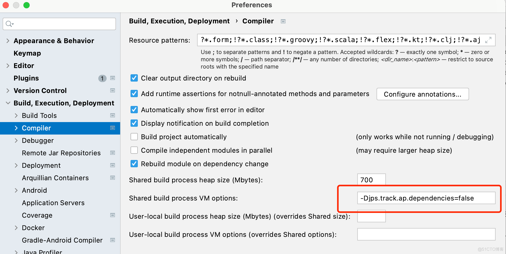
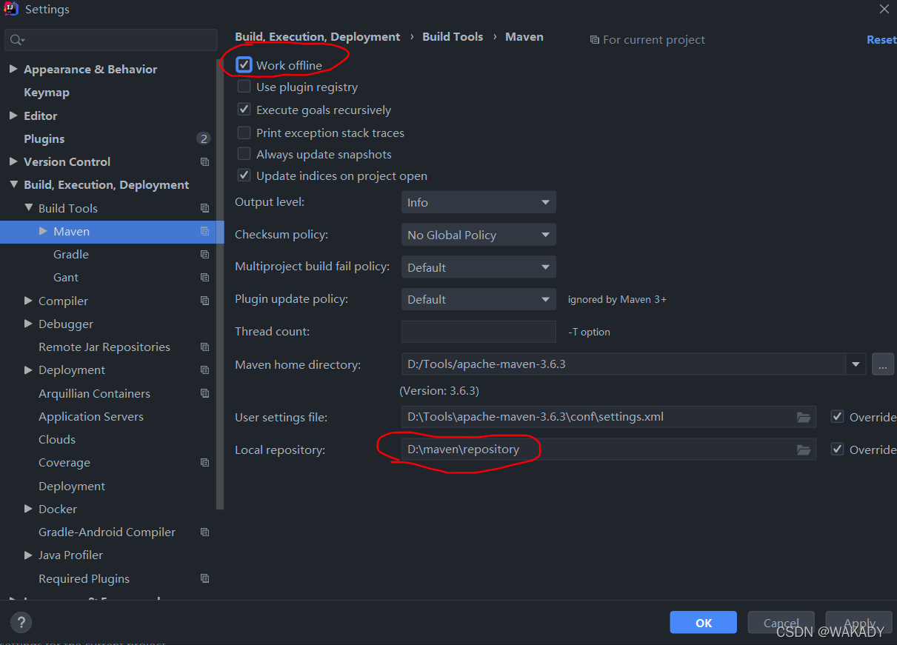

# IDEA 列模式多行编辑 - Win

第一步：File——>Settings——>搜索 column selection mode
（windows上默认的快捷键是：shift + alt + insert）

第二步：鼠标放在你需要多行编辑的地方，ctrl + A 全选需要执行多行编辑的内容

第三步：按住shift + alt，再按2次insert，全选的内容就出来了，就可以自由编辑了

# IDEA 字符串大小写转换

MAC：command + shift + u
Win：ctrl + shift + u


# idea 编译代码报错

错误日志:

```text
java: JPS incremental annotation processing is disabled. Compilation results on partial recompilation may be inaccurate. Use build process "jps.track.ap.dependencies" VM flag to enable/disable incremental annotation processing environment.
```
解决方案：


```text
-Djps.track.ap.dependencies=false
```

# IDEA， maven 离线模式下，工程无法导入依赖包的问题
> 解决方案：
> 第一步、配置Maven离线模式



> 第二步：将需要更新的jar包拷贝到仓库对应位置。可以在外网先下载好所需要的包。
> 
> 第三步、（重要） 在整个仓库repository中搜索，删除所有的 _remote.repositories 和 lastUpdate 文件。
> 这一步也是最总要的一步，需要在整个Maven仓库中搜索所有的 _remote.repositories(我删除了这个所有的文件就可以了) 和
> lastUpdated 文件，将其删除。
> 
> 需要删除 _remote.repositories 和 lastUpdate 文件的原因是，该文件是jar包对应的配置文件，其中包含了在外网项目的一些配置，所以在导入内网会报错。


