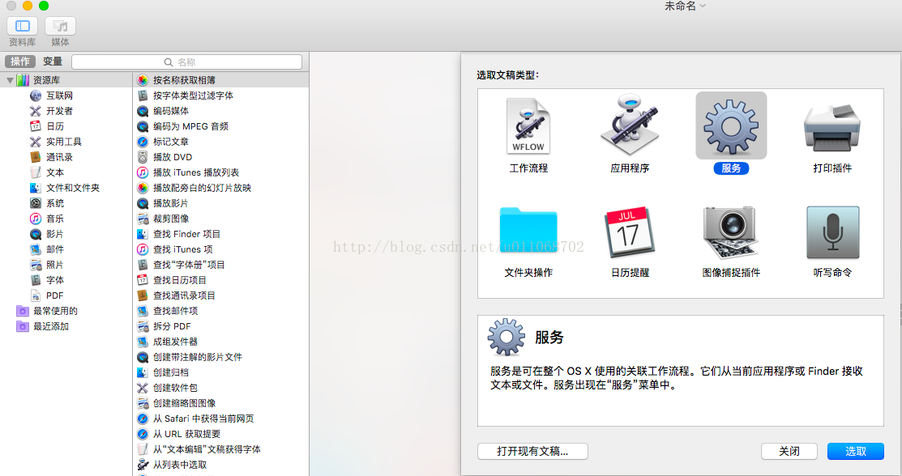
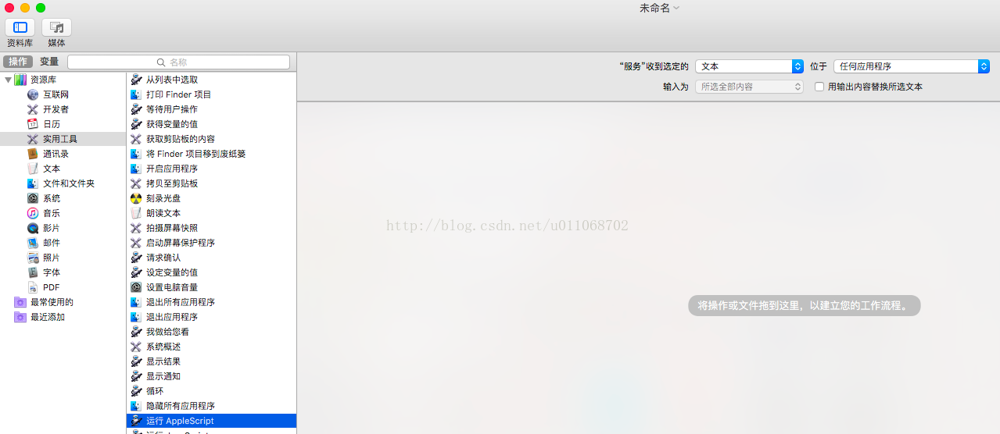
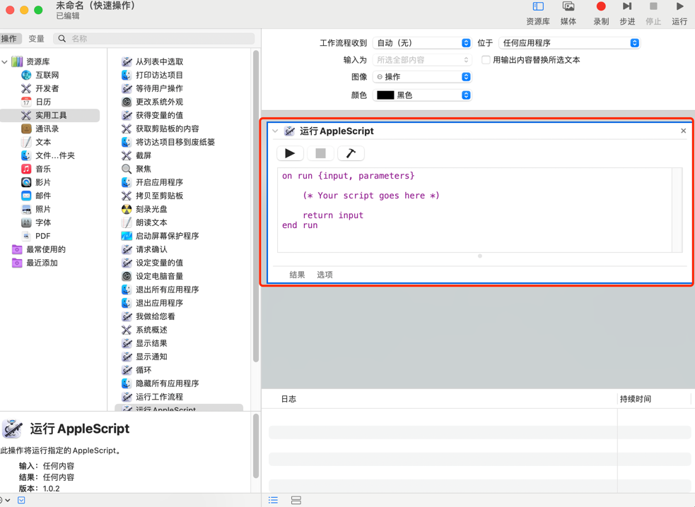
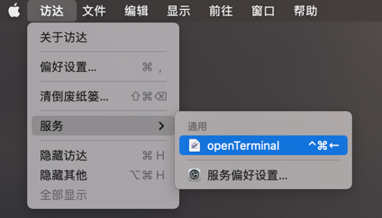
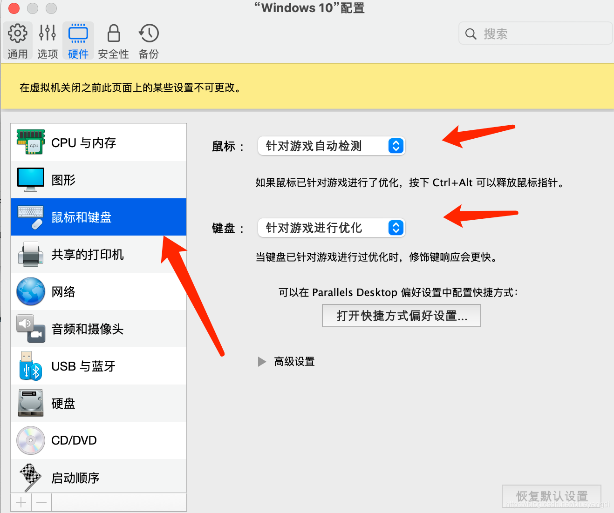
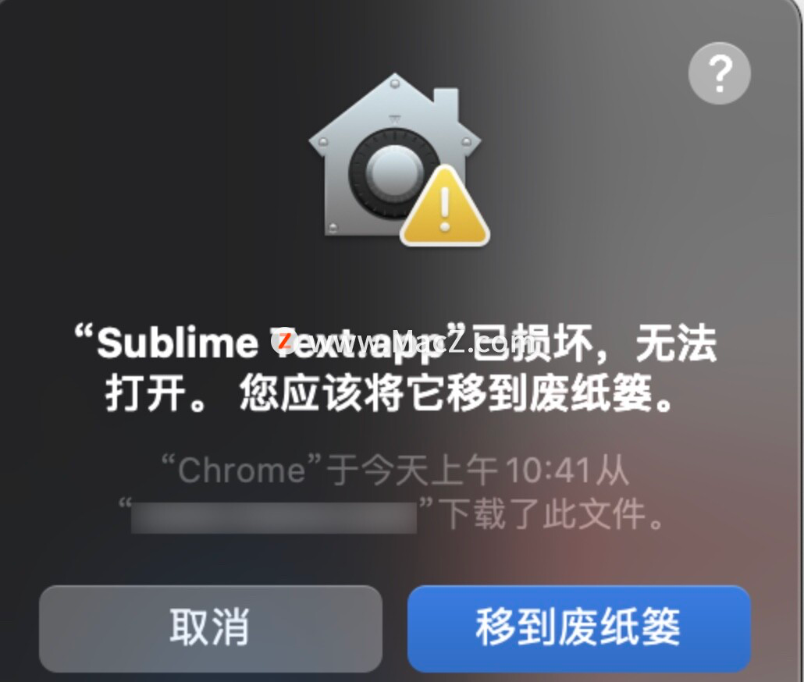

# 禁用 MacOS 升级角标提醒

## 系统版本 小于 10.15.5 or 等于 10.15.6
（是的，就是这么奇怪，该策略在10.15.5中被弃用了，但在10.15.6中又放出来了，之后又去掉了，参考）
打开 终端(Terminal)

执行 sudo softwareupdate --ignore "macOS Big Sur"。如果处于 Mojave 想阻止升级到 Catalina, 把命令中的 Big Sur 改成 Catalina即可。
（如果改变主意想接收更新了，执行 sudo softwareupdate --reset-ignored即可恢复）

## 系统版本 等于 10.15.5 or 大于 10.15.6

执行: defaults write com.apple.systempreferences AttentionPrefBundleIDs 0 && killall Dock，小红点就消失了，不再提示升级了

恢复: defaults write com.apple.systempreferences AttentionPrefBundleIDs 1 && killall Dock

## 显卡切换

MacBook Pro 强制使用集成显卡以增加电池续航时间：

使用命令查看当前显卡使用状体：

```shell
pmset -g
```

查看 gpuswitch 对应值， 0：为集成显卡； 1：为独立显卡；2：为自动切换

使用命令切换：

### 强制使用集成显卡：

```shell
sudo pmset -a GPUSwitch 0
```

### 强制使用独立显卡

sudo pmset -a GPUSwitch 1


### 强制使用自动切换显卡

sudo pmset -a GPUSwitch 2


# 安装 brew
将下面命令复制到终端:

/bin/zsh -c "$(curl -fsSL https://gitee.com/cunkai/HomebrewCN/raw/master/Homebrew.sh)"


# 删除终端连接的历史记录

## 查询连接记录

## 下面用户名替换成你本机实际的用户名

defaults read /Users/用户名/Library/Preferences/com.apple.Terminal.plist PreviousCommands

## 删除连接记录

## 下面用户名替换成你本机实际的用户名

defaults delete /Users/用户名/Library/Preferences/com.apple.Terminal.plist PreviousCommands

# 终端删除软件残余

1. 安装包安装方式：直接在程序坞中将软件拖到垃圾箱即可;
2. 命令安装：用Homebrew或者MacPorts安装的，也是使用命令卸载，brew install xxx是安装，brew uninstall xxx就是卸载了
   源码安装的，是直接到程序目录删除对应程序就好了（会安装的人肯定会删除）；

上述第二种删除完软件后有的软件会有残留，可以使用下面命令进行删除。

命令如下:

```shell
mdfind -name "软件名称"
```

该命就会搜索该软件的相关文件，然后根据对应的目录删除

# 打造属于你自己的 mac 终端

## 什么是 oh-my-zsh

Oh My Zsh 是一款社区驱动的命令行工具，正如它的主页上说的，Oh My Zsh 是一种生活方式。它基于 zsh 命令行，提供了主题配置，插件机制，已经内置的便捷操作。给我们一种全新的方式使用命令行。
Oh My Zsh 是基于 zsh 命令行的一个扩展工具集，提供了丰富的扩展功能。
安装 Oh My Zsh 前提条件：必须已安装 zsh

其实我就是为了主题好看点儿。

## 安全 oh-my-zsh

直接运行如下命令

```shell
sh -c "$(curl -fsSL https://raw.github.com/robbyrussell/oh-my-zsh/master/tools/install.sh)"
```

发现执行命令报错:

```text
curl: (7) Failed to connect to raw.githubusercontent.com port 443: Connection refused
```
原因就是https://raw.githubusercontent.com/ohmyzsh/ohmyzsh/master/tools/install.sh这个网站是被墙的。

开一个梯子，打开https://raw.githubusercontent.com/ohmyzsh/ohmyzsh/master/tools/install.sh保存此脚本到本机。
执行sudo sh ./install.sh。安装成功后输出大致如下：

```text
xxxx% sh -c "$(curl -fsSL https://raw.github.com/robbyrussell/oh-my-zsh/master/tools/install.sh)" 
Cloning Oh My Zsh...
Cloning into '/Users/xxxx/.oh-my-zsh'...
remote: Counting objects: 831, done.
remote: Compressing objects: 100% (700/700), done.
remote: Total 831 (delta 14), reused 775 (delta 10), pack-reused 0
Receiving objects: 100% (831/831), 567.67 KiB | 75.00 KiB/s, done.
Resolving deltas: 100% (14/14), done.
Looking for an existing zsh config...
Found ~/.zshrc. Backing up to ~/.zshrc.pre-oh-my-zsh
Using the Oh My Zsh template file and adding it to ~/.zshrc
             __                                     __   
      ____  / /_     ____ ___  __  __   ____  _____/ /_  
     / __ \/ __ \   / __ `__ \/ / / /  /_  / / ___/ __ \ 
    / /_/ / / / /  / / / / / / /_/ /    / /_(__  ) / / / 
    \____/_/ /_/  /_/ /_/ /_/\__, /    /___/____/_/ /_/  
                            /____/                       ....is now installed!
Please look over the ~/.zshrc file to select plugins, themes, and options.
p.s. Follow us at https://twitter.com/ohmyzsh.
p.p.s. Get stickers and t-shirts at http://shop.planetargon.com.
```

## 使用 Powerlevel10k 主题配置

Powerlevel10k 主题可以用于 zsh, oh-my-zsh, Prezto, Antigen 等等。
Powerlevel10k 依托于 zsh, oh-my-zsh, Prezto, Antigen。
这里我们直接使用 oh-my-zsh。

官网有说明：

找到 Oh My Zsh

然后执行命令:

```shell
git clone --depth=1 https://github.com/romkatv/powerlevel10k.git ${ZSH_CUSTOM:-$HOME/.oh-my-zsh/custom}/themes/powerlevel10k
```

注意该命令需要在你的 home 目录下。即可以看到 Desktop 文件夹。
设置 .zshrc 主题:

```shell
ZSH_THEME="powerlevel10k/powerlevel10k"
```

具体 Theme 的自定义样式在这个链接中:

https://github.com/Powerlevel9k/powerlevel9k/wiki/Show-Off-Your-Config

虽然是 Powerlevel9k 但是 10 的也可以用。

注意不同的字体可能需要对应不同的字体，否则会出现乱码，主题下面会有对应的安装说明。具体终端如何配置字体这里就不过多赘述了。

重新配置

```shell
p10k configure
```
至此，自己好看的的 Mac 终端算是完成了。放一张图展示一波：

有时候 Oh My Zsh 在 .zshrc 的插件并没有很齐全导致打开终端的时候会出现报错，如下：


# mac 安装 unrar
 unrar 是解压 xx.rar 的命令

常用命令如下：

```shell
进到需要解压的文件夹：cd 'target_path'
解压.rar文件到当前文件夹：unrar e 'file_name'
解压.rar文件到指定路径：unrar x 'file_name' 'target_path'
解压带密码的.rar文件到当前文件夹：unrar e -p'123' 'file_name'
解压带密码的.rar文件到指定文件夹：unrar x -p'123' 'file_name' 'target_path'
```
# mac 设置启动 Terminal 的快捷键

## 找到 Automator

command + space，在聚焦搜索中搜索 Automator , 然后在你的任务兰中单击 Automator, 选取服务：



进入操作页面后，选择使用工具, 点击右侧的 AppleScript。 如下图:



双击运行 AppScript 然后将右边的文本输入修改为如下程序:



```shell
on run {input, parameters}
     (* Your script goes here *)
     tell application "Terminal"         
          reopen         
          activate        
         end tell
end run
```
command + s 保存，命名：openTerminal

然后退出啊，点击左上角的苹果图标，选择偏好设置-》键盘设置-》快捷键-》服务，找到刚才命名的服务，选中添加快捷键，然后推出，使用快捷键测试是否生效。



# Mac 无法创建公司日志的文件夹

因为MAC 更新BigSur后默认有系统文件保护, 根目录没有权限 (其实从catalina起安全性提升就不可以了)

## 解决办法

使用synthetic.conf将文件挂载

1. sudo vi /etc/synthetic.conf;
2. 进行文件映射 or 软连接,如: data    Users/xxx_name/log;
3. 注意必须使用 tab 键分隔，否则重启不会生效; 
4. 上述是 : 建立data到Users/zkq/loga的链接 
5. 必须重启电脑才会生效 
6. 记得在你的用户目录下mkdir log

做完这些步骤后, 我们可以看到, 在系统根目录下出现了 data 文件夹, 软连接到 /Users/xxx_name/log : 

# Mac JDK 多环境配置

编辑 vim  ～/.bash_profile 该文件，配置如下：

```shell
**export JAVA_8_HOME=/Library/Java/JavaVirtualMachines/jdk1.8.0_191.jdk/Contents/Home
export JAVA_17_HOME=/Library/Java/JavaVirtualMachines/jdk-17.0.1.jdk/Contents/Home
export JAVA_HOME=$JAVA_8_HOME
 
alias jdk8='export JAVA_HOME=$JAVA_8_HOME'
alias jdk17='export JAVA_HOME=$JAVA_17_HOME'
 
export PATH=$JAVA_HOME/bin:$PATH
export CLASSPATH=.:$JAVA_HOME/lib/dt.jar:$JAVA_HOME/lib/tools.jar
```

jdk 根据自己安全的版本来配置。填写自己的安装位置。

保存后，要使其生效需要执行下面的命令:

```shell
source ~/.bash_profile
source /etc/profile
```

备注：source后边必须跟"/etc/profile" 这个路径，否则通过alias别名切换jdk版本可能会失败。

 使用命令验证 java 版本是否切换正确
 
```shell
java -version
```

# mac 安装破解软件提示安装包损坏
打开终端，输入命令：
```shell
sudo spctl --master-disable
```
然后打开系统偏好设置：打开系统偏好设置 > 安全性与隐私，若显示任何来源，然后再次打开破解软件即可

# Mac 安装pd虚拟机，远程桌面无法使用ctrl或其他符号无法使用问题

设置针对游戏优化就可以了。

# Mac 提示文件已损坏

执行命令
```shell
sudo xattr -r -d com.apple.quarantine /Applications/Sublime\ Text.app  
```
sudo xattr -r -d com.apple.quarantine 输入前面的命令，可以直接从访达程序中拖拽程序到终端