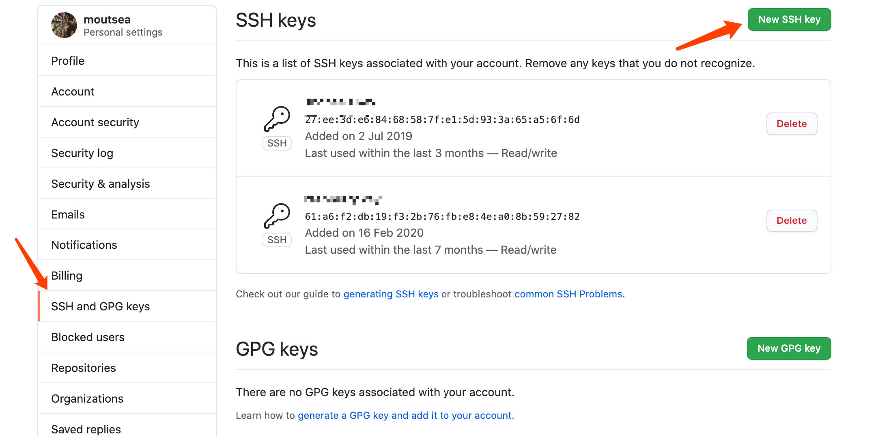

# Git 安装配置仓库

## git 配置

git 常用的配置一般来说就两个：1. 全局用户配置；2. 全局邮箱配置。无论对于 github 还是 gitlab 来说，仓库的关联都是通过这两个配置实现。命令如下：

```shell
git config --global user.name xxxxx # xxx  表示你的姓名
git config --global user.email xxxxx@xxx # xxxxx@xxx 表示你的邮箱地址 
```

第二个配置是针对一些常用的 git 命令，我们可以配置别名，配置方式有两种：

第一种使用命令：

```shell
git config --global alias.st status  # st 替换status
git config --global alias.co checkout # co 替换checkout
```

第二种方式：

找到 gitconfig 这个文件，如果找不到可以自己创建一个。然后在文件中输入想要的配置即可。模版如下：

```shell
[user]
 name = chengzhi
 email = chengzhi@gmail.com
[alias]
 co = checkout
 br = branch
 ci = commit
 st = status
```

上述配置只是针对 git 的配置，并没有使 github 与我们有什么关系。此时需要我们生成一个公钥，然后将公钥填写到 github 的公钥管理中。
执行命令：

```shell
ssh-keygen -t rsa -C "xxxx@xxxxx" #  注意这里的邮箱地址要么上面配置的 git 一样
```

然后一路无脑回车确认，然后会生成一个 .ssh 文件夹，里面有一个名称为：id_rsa.pub 文件，然后将里面的内容复制到 github 的密钥管理中即可。

怎么找 github 的密钥管理：点击左上角你自己的头像，然后点击 SSH and GPG keys 管理，然后点击 New SSH key，复制你文件的密钥内容即可。



然后使用 git 命令下拉你自己的仓库代码即可。


# Git 操作命令
## 代码覆盖

在使用 Git 修改时，我们有时候想要获取服务器上的最新代码，并且放弃本地修改，此时操作如下：

git fetch --all
git reset --hard origin/master  (后面是分支版本)
git pull

## 版本回退

git reset --hard HEAD^         回退到上个版本

git reset --hard HEAD~3        回退到前3次提交之前，以此类推，回退到n次提交之前

git reset --hard commit_id     退到/进到 指定commit的代码

git push origin HEAD --force   强制推到远程

# github 443 无法访问

添加 VPN 的代理接口(前提是你有梯子)

添加全局代理:  

```shell
git config --global http.proxy xxxxx // 你的代理接口地址
```

# git clone 时显示Filename too long的解决办法

在git bash中，运行下列命令：
````shell
git config --global core.longpaths true
```
就可以解决该问题。

--global是该参数的使用范围，如果只想对本版本库设置该参数，只要在上述命令中去掉--global即可。

