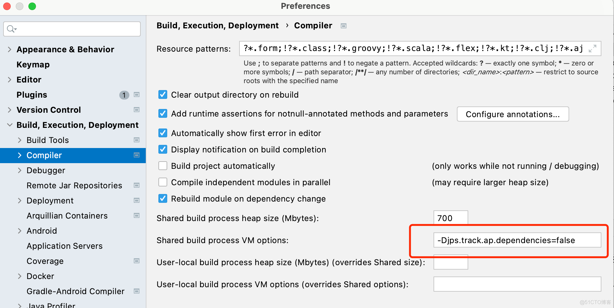

# IDEA 列模式多行编辑 - Win

第一步：File——>Settings——>搜索 column selection mode
（windows上默认的快捷键是：shift + alt + insert）

第二步：鼠标放在你需要多行编辑的地方，ctrl + A 全选需要执行多行编辑的内容

第三步：按住shift + alt，再按2次insert，全选的内容就出来了，就可以自由编辑了

# IDEA 字符串大小写转换

MAC：command + shift + u
Win：ctrl + shift + u


# idea 编译代码报错

错误日志:

```text
java: JPS incremental annotation processing is disabled. Compilation results on partial recompilation may be inaccurate. Use build process "jps.track.ap.dependencies" VM flag to enable/disable incremental annotation processing environment.
```
解决方案：


```text
-Djps.track.ap.dependencies=false
```

# MAC IDEA 常用快捷键
1. 查看方法的调用链：Ctrl + Alt + H
2. 优化import语句: Ctrl + Alt + O, 剔除无用的import语句，强迫症选手必用。
3. 查看uml类图 Command + Alt + U
4. 生成代码（getter、setter、hashCode、equals、toString、构造函数等） Command + N, Control + Enter, Control + N
5. Control + O 	覆盖方法（重写父类方法）
6. Control + I 实现方法（实现接口中的方法）


